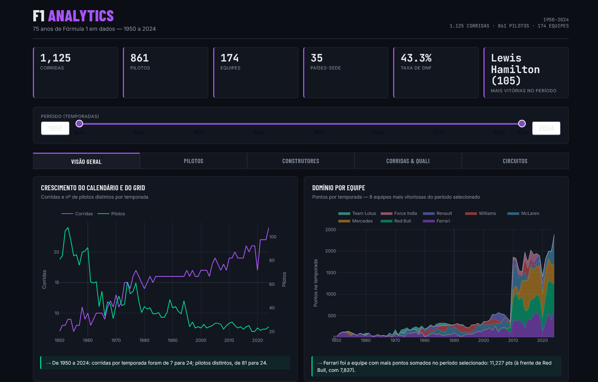
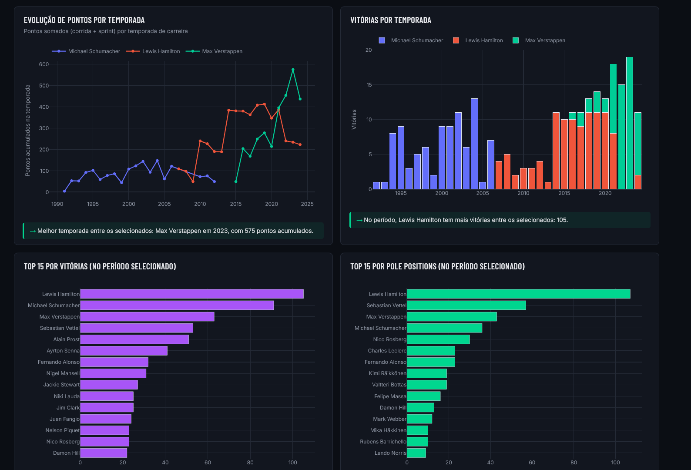
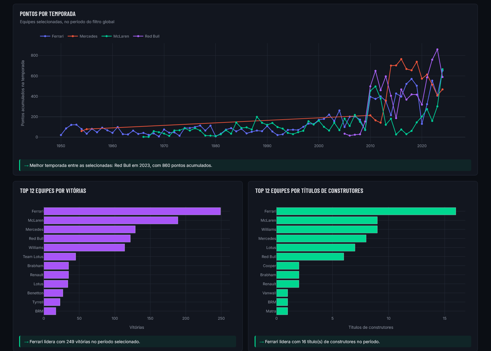
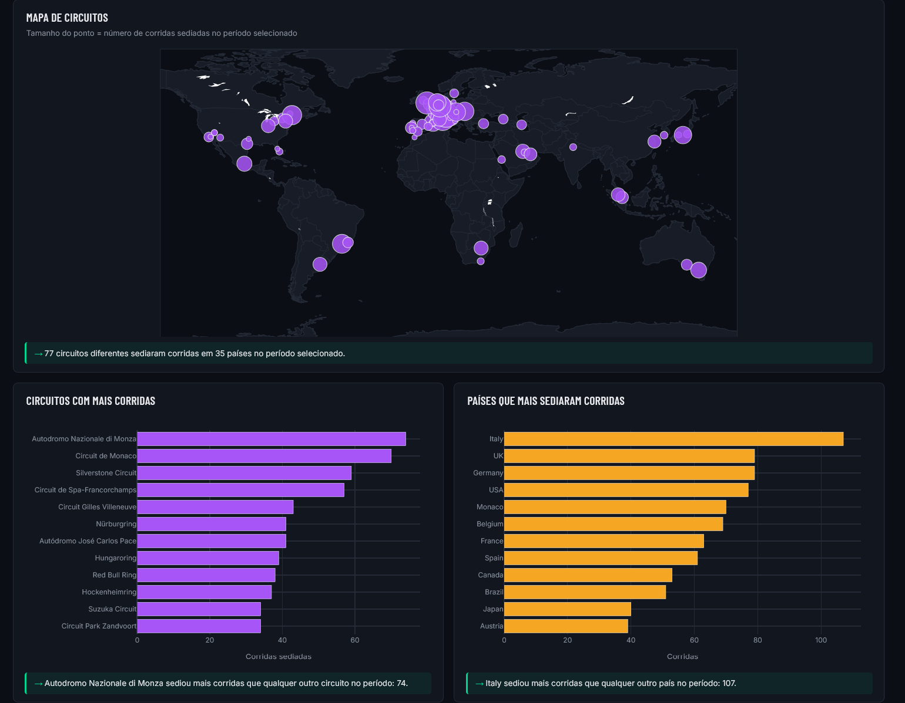

# F1 Analytics — 75 anos de Fórmula 1 em dados (1950-2024)

Pipeline de dados completo + análise exploratória + dashboard interativo sobre
toda a história do campeonato mundial de Fórmula 1, da temporada de 1950 até
o fim de 2024.

Projeto de portfólio focado em **engenharia de dados**: o valor não está só
nos gráficos, mas no pipeline que limpa, valida e corrige um dataset público
real — incluindo alguns bugs sutis nos dados que só aparecem quando você
cruza as tabelas certas (detalhes na seção [Decisões de engenharia](#decisões-de-engenharia-de-dados)).

https://f1-dashboard-zcvw.onrender.com - Dashboard ao Vivo







```
f1-analytics/
├── data/
│   ├── raw/                     # CSVs originais (schema estilo Ergast)
│   └── processed/                # 18 tabelas Parquet limpas/enriquecidas (saída do ETL)
├── etl/
│   └── build_processed_data.py   # raw -> processed: limpeza, joins, features, agregações
├── notebooks/
│   ├── eda_formula1.ipynb        # análise exploratória, já executada com os gráficos
│   └── build_notebook.py         # script que gera o notebook programaticamente (opcional)
├── dashboard/
│   ├── app.py                    # aplicação Dash (5 abas, filtros, ~20 gráficos)
│   ├── data.py                   # carregamento das tabelas processadas
│   ├── theme.py                  # paleta de cores e estilo dos gráficos plotly
│   └── assets/style.css          # tema visual (dark, inspirado nos telões de tempo da F1)
├── requirements.txt
└── README.md
```

## Como rodar

```bash
python -m venv venv
source venv/bin/activate          # Windows: venv\Scripts\activate
pip install -r requirements.txt

# (opcional) regerar os dados processados a partir do raw
python etl/build_processed_data.py

# rodar o dashboard
cd dashboard
python app.py
# abrir http://127.0.0.1:8050
```

O notebook (`notebooks/eda_formula1.ipynb`) já vem executado com os gráficos
embutidos — dá pra abrir e ler direto no GitHub sem rodar nada. Se quiser
reexecutar: `jupyter notebook notebooks/eda_formula1.ipynb`.

## Fonte dos dados

CSVs em schema clássico do Ergast (o antigo Ergast Developer API foi
descontinuado em 2024; hoje o sucessor direto é a [Jolpica-F1
API](https://api.jolpi.ca/ergast/f1)). Cobertura: 1.125 corridas, 861
pilotos, 174 famílias de construtores, 35 países, 75 temporadas completas
(1950-2024). Licença dos dados originais: uso não comercial.

**Sobre a temporada mais recente:** o dataset usado aqui vai até o fim de
2024. As temporadas de 2025 (campeão: Lando Norris) e 2026 não estão
incluídas — dependem da API mais nova (Jolpica), que não estava acessível a
partir do ambiente onde este pipeline foi construído. Fica como próximo
passo natural (ver [Possíveis extensões](#possíveis-extensões)).

## Decisões de engenharia de dados

Vale documentar porque afetam diretamente a confiabilidade dos números —
esse é o tipo de detalhe que separa um dashboard "bonito" de um dashboard
**correto**:

1. **Pontos de sprint race ficavam de fora.** Desde 2021 a F1 tem corridas
   sprint que também valem pontos de campeonato, mas vêm num arquivo
   separado do resultado da corrida principal. Sem somar isso, o total de
   pontos de 2021 do Verstappen aparecia 7 pontos a menos que o real — o
   suficiente pra bagunçar visualmente quem estava na frente do
   campeonato mais disputado da década. Corrigido no ETL (`total_points`
   = pontos de corrida + pontos de sprint).

2. **"Somar pontos de todas as corridas da temporada" não é igual a
   "campeão oficial".** As regras de pontuação mudaram muitas vezes na
   história da F1 — boa parte de 1950 a ~1990 usava sistema de descarte
   (só os N melhores resultados contavam). Testando contra uma lista
   oficial de campeões: somar todos os pontos da temporada erra o campeão
   em **5 das 75 temporadas** (1961, 1964, 1970, 1977, 1988) — em duas
   delas o campeão real teve *menos* pontos somados que o vice. Por isso a
   tabela de campeões (`season_champions.parquet`) foi verificada contra
   fonte externa confiável em vez de calculada.

3. **Pilotos "duplicados" na mesma corrida não são erro.** Em 42 corridas
   entre 1950-1962 (e uma em 1978) o mesmo piloto aparece duas vezes na
   classificação — reflexo do *shared drive*, prática real da época em que
   um piloto podia assumir o carro do companheiro de equipe após abandonar
   o seu (o caso mais famoso: Fangio e Fagioli dividiram o carro vencedor
   do GP da França de 1951). As agregações do pipeline já são robustas a
   isso.

4. **"Tempo de pit stop" mede o pit lane inteiro, não só a troca de
   pneu.** O campo de duração do dataset é o tempo total da entrada à
   saída do pit lane — por isso a mediana fica na casa dos 20-25s, bem
   longe dos recordes de troca de pneu (~2s) que aparecem no senso comum.
   Isso muda a leitura do gráfico de "pit stops ficaram mais rápidos": no
   pit lane como um todo, praticamente não ficaram (2011-2024).

5. **Comparar tempo de volta entre temporadas só faz sentido no mesmo
   circuito** — cada ano tem um calendário diferente, com pistas de
   comprimentos diferentes. O gráfico de evolução de ritmo usa Monza (o
   circuito com mais edições da história, 74 de 75 temporadas) em vez de
   uma média global que misturaria pista curta com longa.

6. Constructores antigos (pré-1980) às vezes aparecem no dataset separados
   por combinação chassi+motor (ex.: "Cooper-Climax" e "Cooper-Maserati"
   como entidades diferentes na mesma temporada), mesmo premiando um único
   campeonato de construtores por ano. O pipeline agrupa isso numa
   `constructor_family` (nome antes do primeiro hífen) para as agregações
   de equipe fazerem sentido histórico.

## O dashboard

5 abas, com um filtro global de intervalo de temporadas que afeta todos os
KPIs e gráficos:

- **Visão Geral** — crescimento do calendário/grid, domínio por equipe,
  tabela de campeões por temporada
- **Pilotos** — comparação de até 6 pilotos (evolução de pontos, vitórias
  por temporada), rankings de vitórias/poles, tabela de estatísticas
- **Construtores** — mesma lógica para equipes
- **Corridas & Quali** — largada x resultado final, taxa e causas de DNF,
  duração de pit stop, evolução de ritmo de classificação por circuito
- **Circuitos** — mapa mundial, ranking de circuitos/países, estatísticas

## Possíveis extensões

- Puxar 2025/2026 via [Jolpica-F1 API](https://api.jolpi.ca/ergast/f1) para
  manter o dataset atualizado
- Adicionar `fact_lap_times` completo (já processado, ~590k linhas) numa
  aba de "ritmo de corrida" volta a volta
- Deploy do dashboard (Render, Fly.io, ou similar) pra ter link público
  além do GitHub
